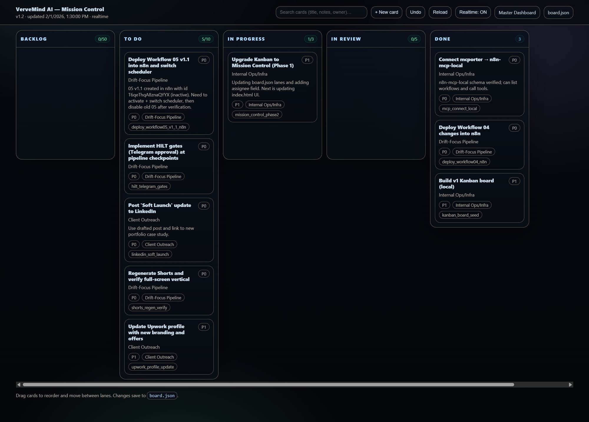

# Case Study #2: VerveMind Ops Kit (Real-Time Command Center)

> #### **Project: "VerveMind Ops Kit" — A Real-Time Project Command Center**
>
> **Objective:** To build a lightweight, self-hosted, and instantaneous internal dashboard for tracking tasks and operational status, avoiding the complexity and subscription fees of larger tools like JIRA or Asana.
>
> ---
>
> #### **The Problem**
>
> Small, agile teams often struggle with project management tools that are either too simple (like a basic to-do list) or too complex and slow (like JIRA). There was a need for a "command center" that provided an at-a-glance view of all work-in-progress with zero latency, keeping the entire team in sync without constant page refreshing.
>
> #### **The Solution**
>
> I developed a custom, real-time Kanban board and dashboard system built on a lightweight and efficient stack, centered around Server-Sent Events (SSE) for instant data pushes from the server to all connected clients.
>
> The key components are:
>
> 1.  **Real-Time Backend (Node.js):** A simple Node.js server manages the core logic. It serves the frontend and exposes a few key endpoints: an API for fetching/updating the board state, and an `/events` endpoint for SSE connections.
> 2.  **Persistent Data Store (JSON):** The entire state of the Kanban board (lanes, cards, assignees) is stored in a simple `board.json` file on the server. This avoids the need for a heavy database and makes the system portable and easy to back up.
> 3.  **Reactive Frontend (HTML/CSS/JS):** The frontend is built with vanilla JavaScript and CSS, ensuring it's incredibly fast and has no dependencies.
>     *   When a user drags and drops a card, the new state is sent to the server API.
>     *   The server saves the change to `board.json` and immediately pushes a "file-changed" event via SSE to all connected clients.
>     *   All clients receive the event and automatically re-render the board, ensuring everyone sees the change in sub-second time.
>
> #### **The Result**
>
> The VerveMind Ops Kit provides the real-time fluidity of high-end collaboration tools in a simple, self-hosted package.
>
> *   **Instantaneous Sync:** Card movements are reflected on all users' screens instantly, eliminating the "is this up to date?" problem.
> *   **Zero Subscription Fees:** Because it's self-hosted and built on a minimal stack, there are no recurring SaaS fees.
> *   **Extreme Simplicity:** By using a flat-file JSON database and vanilla JavaScript, the entire system is easy to understand, maintain, and extend.
> *   **Visual Clarity:** Features like WIP (Work-In-Progress) limits on lanes provide immediate visual cues about bottlenecks.
>
> **Technologies Used:**
> `Node.js` | `Server-Sent Events (SSE)` | `JavaScript (Vanilla)` | `HTML5` | `CSS`

